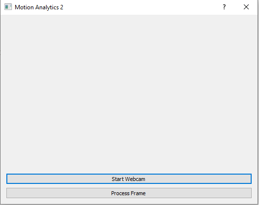
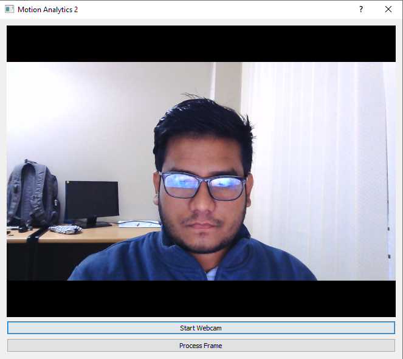

# qt-motion-analysis
Pose estimation with descriptive analysis

### Download pre-trained weight

https://drive.google.com/file/d/1n-H_cvTHNldZuz08EE62WiVtqqXzemKq/view?usp=sharing

### Install

`pip install -r requirements.txt`

### Running

If you have only one webcam - 

`python main.py`

If you have more than one webcam - 

`python main.py i`

Here, `i` is the webcam index.

### Logs

Processed frames are saved in logs folder.

### Demo

#### Window 1

  

#### Window 2
 

  

#### Window 3

  

