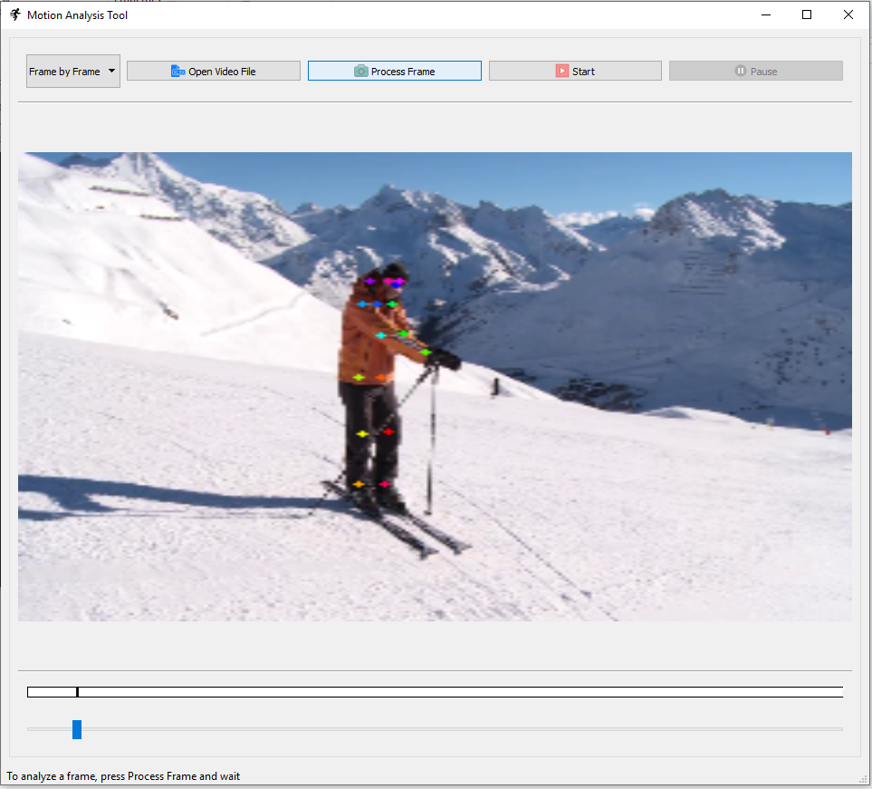

# qt-motion-analysis
Pose estimation player from video with descriptive analysis

### Download pre-trained weight

https://drive.google.com/file/d/1n-H_cvTHNldZuz08EE62WiVtqqXzemKq/view?usp=sharing

### Install

`pip install -r requirements.txt`

### Running

`python main.py`

### Logs

Processed frames are saved in logs.db.

### Demo

#### Window 1 (after running python main.py)

  

#### Window 2 (after selecting a video file)
 

  

#### Window 3 (after clicking Process Frame button)

  

### Pose estimator backend

`https://github.com/zabir-nabil/keras-human-pose`

### Source credit

`https://github.com/balcilar/VideoPlayer-PyQT`